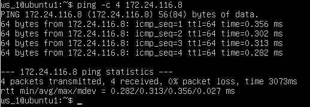
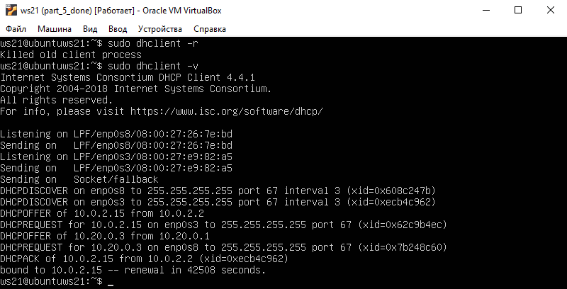

## Part 1. Инструмент ipcalc

# 1.1. Сети и маски

* Определить:

*sudo apt install ipcalc*

1. Адрес сети 192.167.38.54/13:

*ipcalc 192.167.38.54/13*

Адрес сети: *192.160.0.0*

2. Перевод маски 255.255.255.0 в префиксную и двоичную запись, /15 в обычную и двоичную, 11111111.11111111.11111111.11110000 в обычную и префиксную:

* Перевод маски 255.255.255.0:

Перевод маски *255.255.255.0* в префиксную запись: */24*  
Перевод маски *255.255.255.0* в двоичную запись: *11111111.11111111.11111111.00000000*

* Перевод маски /15:

Перевод маски */15* в обычную запись: *255.254.0.0*  
Перевод маски */15* в двоичную запись: *11111111.11111110.00000000.00000000*

* Перевод маски 11111111.11111111.11111111.11110000:

Перевод маски *11111111.11111111.11111111.11110000* в префиксную запись: */28*

Перевод маски *11111111.11111111.11111111.11110000* в обычную запись: *255.255.255.240*

3. Минимальный и максимальный хост в сети 12.167.38.4 при масках: /8, 11111111.11111111.00000000.00000000, 255.255.254.0 и /4:

* Минимальный и максимальный хост в сети 12.167.38.4 при маске /8:

Минимальный хост: *12.0.0.1*  
Максимальный хост: *12.255.255.254*

* Минимальный и максимальный хост в сети 12.167.38.4 при маске 11111111.11111111.00000000.00000000:

*11111111.11111111.00000000.00000000* по таблице: */16*

Минимальный хост: *12.167.0.1*  
Максимальный хост: *12.167.255.254*

* Минимальный и максимальный хост в сети 12.167.38.4 при маске 255.255.254.0:

Минимальный хост: *12.167.38.1*  
Максимальный хост: *12.167.39.254*

* Минимальный и максимальный хост в сети 12.167.38.4 при маске /4:

Минимальный хост: *0.0.0.1*  
Максимальный хост: *15.255.255.254*

# 1.2. localhost

1. Определить и записать в отчёт, можно ли обратиться к приложению, работающему на localhost, со следующими IP: 194.34.23.100, 127.0.0.2, 127.1.0.1, 128.0.0.1:

*127.0.0.0* — *127.255.255.255* (Зарезервировано для петлевых интерфейсов (не используется для связи между узлами сети), так называемый localhost)

*194.34.23.100*: нельзя  
*127.0.0.2*: можно  
*127.1.0.1*: можно  
*128.0.0.1*: нельзя

# 1.3. Диапазоны и сегменты сетей

1. Какие из перечисленных IP можно использовать в качестве публичного, а какие только в качестве частных: 10.0.0.45, 134.43.0.2, 192.168.4.2, 172.20.250.4, 172.0.2.1, 192.172.0.1, 172.68.0.2, 172.16.255.255, 10.10.10.10, 192.169.168.1:

Следующие диапазоны адресов зарезервированы для частных (также известных как LAN) сетей:  
- *10.0.0.0* — *10.255.255.255* (*10.0.0.0/8*),
- *172.16.0.0* — *172.31.255.255* (*172.16.0.0/12*),
- *192.168.0.0* — *192.168.255.255* (*192.168.0.0/16*).
- *127.0.0.0* — *127.255.255.255*

Поэтому:  

Можно использовать только в качестве частных: *10.0.0.45*, *192.168.4.2*, *172.20.250.4*, *172.16.255.255*, *10.10.10.10*  
Можно использовать в качестве публичного: *134.43.0.2*, *172.0.2.1*, *192.172.0.1*, *172.68.0.2*, *192.169.168.1*

2. Какие из перечисленных IP адресов шлюза возможны у сети 10.10.0.0/18: 10.0.0.1, 10.10.0.2, 10.10.10.10, 10.10.100.1, 10.10.1.255:

Возможны:*10.10.0.2*, *10.10.10.10*, *10.10.1.255*  
Невозможны:*10.0.0.1*, *10.10.100.1*

## Part 2. Статическая маршрутизация между двумя машинами

* С помощью команды ip a посмотреть существующие сетевые интерфейсы:

*ip a* на ws1:

*ip a* на ws2:

* Описать сетевой интерфейс, соответствующий внутренней сети, на обеих машинах и задать следующие адреса и маски: ws1 - 192.168.100.10, маска /16, ws2 - 172.24.116.8, маска /12:

*sudo vim etc/netplan/00-installer-config.yaml* на ws1:

*sudo vim etc/netplan/00-installer-config.yaml* на ws2:

* Выполнить команду *netplan apply* для перезапуска сервиса сети:

*sudo netplan apply* ws1:

*sudo netplan apply* ws2:

# 2.1. Добавление статического маршрута вручную

* Добавить статический маршрут от одной машины до другой и обратно при помощи команды вида ip r add:

На ws1:

На ws2:

* Пропинговать соединение между машинами:

На ws1:

На ws2:

# 2.2. Добавление статического маршрута с сохранением

* Перезапустить машины:

Командой: *reboot*

* Добавить статический маршрут от одной машины до другой с помощью файла etc/netplan/00-installer-config.yaml:

На ws1:

На ws2:

* Пропинговать соединение между машинами:

На ws1:

На ws2:

## Part 3. Утилита iperf3

# 3.1. Скорость соединения

* Перевести и записать в отчёт: 8 Mbps в MB/s, 100 MB/s в Kbps, 1 Gbps в Mbps:

8 Mbps = 1 MB/s  
100 MB/s = 819 200 Kbps  
1 Gbps = 1024 Mbps

# 3.2. Утилита iperf3

* Измерить скорость соединения между ws1 и ws2:

*sudo apt install iperf3*

*iperf3 -s* на ws2 и *iperf3 -c 172.24.116.8 -p 5201 на ws1*

скрин с ws1:

скрин с ws2:

*iperf3 -s* на ws1 и *iperf3 -c 192.168.100.10 -p 5201 на ws2*

скрин с ws1:

скрин с ws2:

## Part 4. Сетевой экран

# 4.1. Утилита iptables

* Создать файл /etc/firewall.sh, имитирующий фаерволл, на ws1 и ws2:

Командой *sudo vim /etc/firewall.sh* на машине ws1 и машине ws2

Нужно добавить в файл подряд следующие правила:

1) на ws1 применить стратегию когда в начале пишется запрещающее правило, а в конце пишется разрешающее правило (это касается пунктов 4 и 5)

2) на ws2 применить стратегию когда в начале пишется разрешающее правило, а в конце пишется запрещающее правило (это касается пунктов 4 и 5)

3) открыть на машинах доступ для порта 22 (ssh) и порта 80 (http)

4) запретить echo reply (машина не должна "пинговаться”, т.е. должна быть блокировка на OUTPUT)

5) разрешить echo reply (машина должна "пинговаться")

Файл /etc/firewall на ws1:

Файл /etc/firewall на ws2:

* Запустить файлы на обеих машинах командами chmod +x /etc/firewall.sh и /etc/firewall.sh:

Плюс команда *sudo iptables -L* что бы увидеть измения  

На ws1:

На ws2:

* В отчёте описать разницу между стратегиями, применёнными в первом и втором файлах:

Для каждого типа пакетов(Input, forward, output) можно установить набор правил, которые по очереди будут проверяться на соответствие с пакетом и если пакет соответствует, то применять к нему указанное в правиле действие, в стратегии на машине ws1 первым идет правило, которое блокирует исходящие пакеты(output) и отправит отчет об ошибке(reject), оно и применится, ибо стоит первым. В стратегии на машине ws2 первым идет правило, которое разрешает соединение(accept), аналогично оно стоит первым и применится для исходящих пакетов. Когда мы "пигуем" ws1, она не может нам ответить, когда же "пингуем" ws2 она нам отвечает.

# 4.2. Утилита nmap

* Командой ping найти машину, которая не "пингуется", после чего утилитой nmap показать, что хост машины запущен:

Команда *ping* на ws1:

Команда *ping* и после *nmap* на ws2:

В выводе nmap есть: Host is up.

## Part 5. Статическая маршрутизация сети

# 5.1. Настройка адресов машин

* Настроить конфигурации машин в etc/netplan/00-installer-config.yaml согласно сети на рисунке:

Команда - *sudo vim /etc/netplan/00-installer-config.yaml*

ws11:

ws21:

ws22:

r1:

r2:

* Перезапустить сервис сети:

Команда - *sudo netplan apply*

* Если ошибок нет, то командой *ip -4 a* проверить, что адрес машины задан верно:

Команда - *ip -4 a*

ws11:

ws21:

ws22:

r1:

r2:

* Также пропинговать ws22 с ws21. Аналогично пропинговать r1 с ws11:

Пинг ws22 с ws21:

Пинг ws11 с r1:

# 5.2. Включение переадресации IP-адресов.

Для включения переадресации IP, выполните команду на роутерах: *sysctl -w net.ipv4.ip_forward=1*

r1:

r2:

Откройте файл /etc/sysctl.conf и добавьте в него следующую строку: *net.ipv4.ip_forward = 1*

r1:

r2:

# 5.3. Установка маршрута по-умолчанию

* Настроить маршрут по-умолчанию (шлюз) для рабочих станций. Для этого добавить default перед IP роутера в файле конфигураций:

w11:

w21:

w22:

Команда - *sudo netplan apply*

Вызвать *ip r* и показать, что добавился маршрут в таблицу маршрутизации:

w11:

w21:

w22:

w11:

r2:

# 5.4. Добавление статических маршрутов

* Добавить в роутеры r1 и r2 статические маршруты в файле конфигураций:

r1:

r2:

Команда: *sudo netplan apply*

Вызвать *ip r* и показать таблицы с маршрутами на обоих роутерах:

r1:

r2:

Запустить команды на ws11: *ip r list 10.10.0.0/[маска сети]* и *ip r list 0.0.0.0/0*

В отчёте объяснить, почему для адреса *10.10.0.0/[маска сети]* был выбран маршрут, отличный от 0.0.0.0/0, хотя он попадает под маршрут по-умолчанию:

Так происходит потому что маршрутизатор выбирает маршрут с самой длинной маской, поскольку это более точное решение.  
По этому правилу маршрут по умолчанию никогда не будет выбран, если существуют альтернативные решения.  
0.0.0.0 — это немаршрутизируемый адрес IPv4, который используется в основном в качестве адреса по умолчанию или адреса-заполнителя.  
В контексте серверов 0.0.0.0 означает «все адреса IPv4 на локальном компьютере».

# 5.5. Построение списка маршрутизаторов

* При помощи утилиты traceroute построить список маршрутизаторов на пути от ws11 до ws21:

w11:

* Запустить на r1 команду дампа:

r1: 

* В отчёте, опираясь на вывод, полученный из дампа на r1, объяснить принцип работы построения пути при помощи traceroute:

Команда traceroute отправляет 3 пакета, каждый раз увеличивая значение поля TTL(TTL=1, TTL=2...) пакета, пока он не достигнет цели.
Каждый раз отправляется по три пакета и для каждого из них измеряется время прохождения.
Пакет отправляется на случайный порт который скорее всего не занят. В момент когда утилита traceroute получает сообщение о том, что порт недоступен трассировка считается завершенной.

# 5.6. Использование протокола ICMP при маршрутизации

* Запустить на r1 перехват сетевого трафика, проходящего через eth0 с помощью команды: *tcpdump -n -i eth0 icmp*

* Пропинговать с ws11 несуществующий IP (например, 10.30.0.111) с помощью команды: *ping -c 1 10.30.0.111*

## Part 6. Динамическая настройка IP с помощью DHCP

* Для r2 настроить в файле /etc/dhcp/dhcpd.conf конфигурацию службы DHCP:

1) указать адрес маршрутизатора по-умолчанию, DNS-сервер и адрес внутренней сети:

2) в файле resolv.conf прописать nameserver 8.8.8.8:

Перезагрузить службу DHCP командой *systemctl restart isc-dhcp-server*:

Машину ws21 перезагрузить при помощи *reboot* и через *ip a* показать, что она получила адрес:

Команда *reboot* и *ip a*:

Также пропинговать ws22 с ws21:

Указать MAC адрес у ws11, для этого в etc/netplan/00-installer-config.yaml надо добавить строки: *macaddress: 10:10:10:10:10:BA, dhcp4: true*

Для r1 настроить аналогично r2, но сделать выдачу адресов с жесткой привязкой к MAC-адресу (ws11):

1) указать адрес маршрутизатора по-умолчанию, DNS-сервер и адрес внутренней сети:

2) в файле resolv.conf прописать nameserver 8.8.8.8:

Перезагрузить службу DHCP командой *systemctl restart isc-dhcp-server*:

Конмада *reboot* и *ip a* на ws11:

Настройка адаптера на ws11:

Пинг ws22 с ws11:

Запросить с ws21 обновление ip адреса:

*ip a*

*sudo dhclient -r* и *sudo dhclient -v*

*ip a*

Используемые параметры DHCP:

domain-name-servers — IP-адреса DNS-серверов  
маршрутизаторы - IP-адреса шлюза по умолчанию

## Part 7. NAT

* В файле /etc/apache2/ports.conf на ws22 и r1 изменить строку Listen 80 на Listen 0.0.0.0:80, то есть сделать сервер Apache2 общедоступным:

* Запустить веб-сервер Apache командой service apache2 start на ws22 и r1

* Добавить в фаервол, созданный по аналогии с фаерволом из Части 4, на r2 следующие правила:

1) Удаление правил в таблице *filter - iptables -F*  
2) Удаление правил в таблице "*NA*T" - *iptables -F -t nat*  
3) Отбрасывать все маршрутизируемые пакеты - *iptables --policy FORWARD DROP*

* Запускать файл также, как в Части 4

*chmod +x /etc/firewall.sh* и */etc/firewall.sh*  
Плюс команда *sudo iptables -L* что бы увидеть измения

* Проверить соединение между ws22 и r1 командой *ping*(при запуске файла с этими правилами, ws22 не должна "пинговаться" с r1):

* Добавить в файл ещё одно правило:

4) Разрешить маршрутизацию всех пакетов протокола *ICMP*

* Запускать файл также, как в Части 4

*chmod +x /etc/firewall.sh* и */etc/firewall.sh*  
Плюс команда *sudo iptables -L* что бы увидеть измения

* Проверить соединение между ws22 и r1 командой *ping*(при запуске файла с этими правилами, ws22 должна "пинговаться" с r1):

* Добавить в файл ещё два правила:

5) Включить SNAT, а именно маскирование всех локальных ip из локальной сети, находящейся за r2 (по обозначениям из Части 5 - сеть 10.20.0.0)  
6) Включить DNAT на 8080 порт машины r2 и добавить к веб-серверу Apache, запущенному на ws22, доступ извне сети

* Запускать файл также, как в Части 4

*chmod +x /etc/firewall.sh* и */etc/firewall.sh*  
Плюс команда *sudo iptables -L* что бы увидеть измения

* Проверить соединение по TCP для SNAT, для этого с ws22 подключиться к серверу Apache на r1 командой:
*telnet [адрес] [порт]*

* Проверить соединение по TCP для DNAT, для этого с r1 подключиться к серверу Apache на ws22 командой telnet (обращаться по адресу r2 и порту 8080):

## Part 8. Дополнительно. Знакомство с SSH Tunnels

* Запустить на r2 фаервол с правилами из Части 7:

*chmod +x /etc/firewall.sh* и */etc/firewall.sh*  
Плюс команда *sudo iptables -L* что бы увидеть измения

* Запустить веб-сервер Apache на ws22 только на localhost (то есть в файле /etc/apache2/ports.conf изменить строку Listen 80 на Listen localhost:80):

* Воспользоваться Local TCP forwarding с ws21 до ws22, чтобы получить доступ к веб-серверу на ws22 с ws21 и для проверки, сработало ли подключение и выполните команду *telnet 127.0.0.1 [локальный порт]*:

* Воспользоваться Remote TCP forwarding c ws11 до ws22, чтобы получить доступ к веб-серверу на ws22 с ws11 и для проверки, сработало ли подключение и выполните команду *telnet 127.0.0.1 [локальный порт]*:

